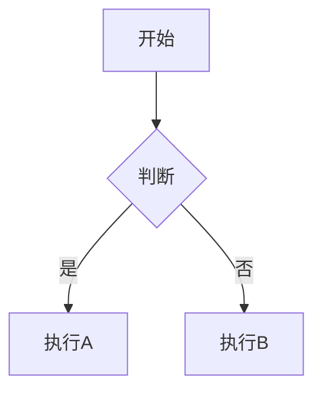

# Markdown Preview v3.1

> 功能强大的 Markdown 实时预览编辑器 | Powerful Markdown Live Preview Editor

[](https://nodejs.org)
[](LICENSE)

---

## 功能特性 | Features

| 功能 | 说明 |
|------|------|
| 实时预览 | 280ms 防抖，敲字即渲染 |
| 多主题 | Light / Dark / Dracula 三种主题 |
| 同步滚动 | 编辑器和预览区域同步滚动 |
| 工具栏 | 快捷插入标题、粗体、斜体、链接、图片、代码块、表格等 |
| 代码高亮 | 使用 highlight.js，支持 190+ 语言 |
| 目录生成 | 自动从标题提取目录 TOC |
| 自动保存 | 每2秒自动保存到 localStorage |
| 导出 HTML | 导出为独立 HTML 文件 |
| 导出 PDF | 通过浏览器打印对话框生成 PDF |
| 复制 HTML | 一键复制渲染后的 HTML |
| 拖拽打开 | 直接拖拽 .md 文件打开 |
| 可调节布局 | 拖拽分割线调整编辑/预览比例 |
| 键盘快捷键 | Ctrl+B/I/K/S/F 等 |
| 字数统计 | 实时字数、字符数、预计阅读时间 |
| **Mermaid 图表** | **[NEW]** 支持流程图、时序图、类图等 |
| **KaTeX 数学公式** | **[NEW]** 支持 LaTeX 数学公式渲染 |
| **Markdown 模板** | **[NEW]** 预设 README、技术文档、博客等模板 |
| **全屏模式** | **[NEW]** 编辑器/预览区全屏切换 |
| **查找替换** | **[NEW]** 编辑器内查找替换功能 |

---

## 快速开始 | Quick Start

```bash
# 克隆项目
git clone https://github.com/MasterPickSelf/md-preview.git
cd md-preview

# 安装依赖
npm install

# 启动服务
npm start
# 访问 http://localhost:3000
```

---

## API 接口 | API Endpoints

| Method | Endpoint | 说明 |
|--------|----------|------|
| `POST` | `/api/render` | Markdown 转 HTML，返回 TOC 和统计 |
| `POST` | `/api/export/html` | 导出为独立 HTML 文件 |
| `POST` | `/api/export/pdf` | 获取 PDF 打印用 HTML |
| `GET` | `/api/preview/:id` | 获取保存的预览会话 |
| `POST` | `/api/preview` | 保存预览会话 |

### POST /api/render
```json
{ "markdown": "# Hello\n\nThis is **bold**." }
```

**响应:**
```json
{
  "success": true,
  "html": "<h1>Hello</h1><p>This is <strong>bold</strong>.</p>",
  "toc": [{ "level": 1, "text": "Hello", "id": "hello" }],
  "stats": { "words": 5, "readTime": "< 1 min", "chars": 30 }
}
```

---

## Mermaid 图表支持

使用 ` ```mermaid ` 代码块：

````markdown

````

支持：流程图、时序图、类图、状态图、甘特图等。

---

## KaTeX 数学公式支持

使用 ` ```math ` 代码块或行内 `$...$`：

````markdown
```math
E = mc^2
```

行内公式: $x = \frac{-b \pm \sqrt{b^2-4ac}}{2a}$
````

---

## 键盘快捷键

| 快捷键 | 功能 |
|--------|------|
| `Ctrl+B` | 粗体 |
| `Ctrl+I` | 斜体 |
| `Ctrl+K` | 链接 |
| `Ctrl+S` | 导出 HTML |
| `Ctrl+F` | 查找替换 |
| `Tab` | 插入两个空格 |
| `Esc` | 退出全屏/关闭面板 |

---

## 技术栈 | Tech Stack

- **Express** - Web 服务器
- **marked** - Markdown 解析
- **highlight.js** - 代码语法高亮
- **jsdom + dompurify** - 安全 HTML 渲染
- **Mermaid** - 图表渲染
- **KaTeX** - 数学公式渲染
- **Vanilla JS** - 前端（零依赖）

---

## License

MIT © 2026 MasterPick
